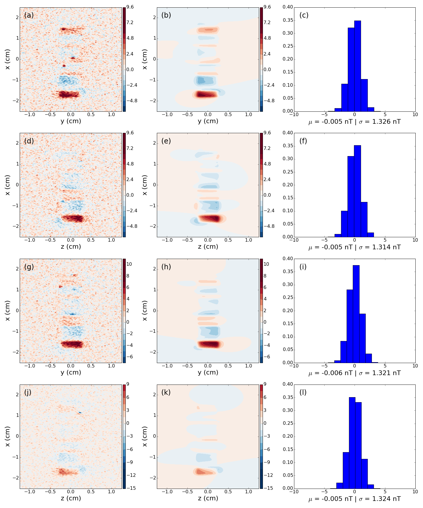
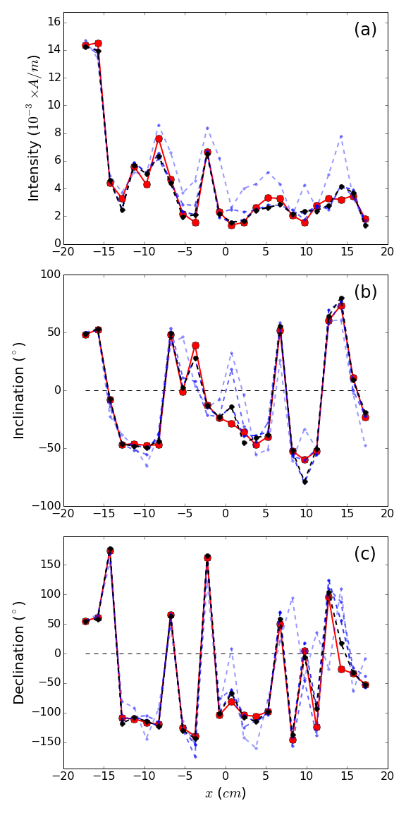

#Estimating the magnetization distribution within rectangular rock samples

[A. L. A. Reis] (http://www.pinga-lab.org/people/andre.html)1, [V. C. Oliveira Jr.](http://www.pinga-lab.org/people/oliveira-jr.html)1, E. Yokoyama2, 
A. C. Bruno3 and Pereira, J. M. B.3

*1Department of Geophysics, Observatório Nacional, Rio de Janeiro, RJ, Brazil.*

*2Institute of Geosciences, University of Brasília, Brasília, DF, Brazil.*

*3Department of Physics, Pontifical Catholic University of Rio de Janeiro, Rio
de Janeiro, RJ, Brazil.*

> This paper has been submitted for publication in 
> [**Geochemistry, Geophysics, Geosystems (G3)**]
> (http://agupubs.onlinelibrary.wiley.com/agu/journal/10.1002/(ISSN)1525-2027/).

####Abstract

Over the last decades, scanning magnetic microscopy techniques have 
been increasingly used in paleomagnetism and rock magnetism. 
Different from standard paleomagnetic magnetometers, scanning 
magnetic microscopes produce high-resolution maps of the vertical 
component of the magnetic induction field (flux density) 
on a plane located over the sample. 
These high-resolution magnetic maps can be used for estimating the 
magnetization distribution within a rock sample by inversion.
Previous studies have estimated the magnetization distribution 
within rock samples by inverting the magnetic data measured on a 
single plane above the sample. Here we present a new spatial domain
method for inverting the magnetic induction measured on four 
planes around the sample in order to retrieve its internal 
magnetization distribution. We have presumed that the internal 
magnetization distribution of the sample varies along one of
its axes. Our method approximates the sample geometry
by an interpretation model composed of a one-dimensional 
array of juxtaposed rectangular prisms with uniform magnetization. 
The Cartesian components of the magnetization vector 
within each rectangular prism 
are the parameters to be estimated by solving a linear inverse problem. 
Our method automatically deals with the averaging of 
the measured magnetic data due to the finite size of the magnetic sensor,
preventing the application of a deconvolution before the inversion.
Tests with synthetic data show the performance of our method in 
retrieving complex magnetization distributions even in 
the presence of magnetization heterogeneities. 
Moreover, they show the advantage of inverting the magnetic data on
four planes around the sample adn how this new acquisition scheme
improves the estimated magnetization distribution within the rock
sample.
We have also applied our method to invert experimentally measured 
magnetic data produced by a highly-magnetized synthetic sample 
that was manufactured in the laboratory.
The results show that, even in the presence of apparent position
noise, our method was able to retrieve the magnetization distribution
consistent with the isothermal remanent magnetization
induced in the sample.

*(a), (d), (g) and (j) Noise-corrupted
magnetic data produced by a synthetic 
marine ferro-manganese crust
sample (not shown) on the
observation four observation planes, respectively.
(b), (e), (h), (k) Predicted data produced by the estimated
magnetization distribution obtained by inversion on the
four observation planes, respectively.
The estimated magnetization distribution was obtained by
inverting the magnetic data located on the four observation
planes.
The color scales are slightly saturated for improving the visualization.
(c), (f), (i) and (l) Normalized histograms of the residuals between the
predicted data shown in (b), (e), (h), (k) and the 
noise-corrupted magnetic data shown in (a), (d), (g), (j). 
The values are in nT.*

*Comparison between the true (red dots)
and estimated (blue and black dots) magnetization (a) intensity, 
(b) inclination and (c) declination.*

> This paper has been submitted for publication in 
> [**Geochemistry, Geophysics, Geosystems (G3)**]
> (http://agupubs.onlinelibrary.wiley.com/agu/journal/10.1002/(ISSN)1525-2027/).

#### Reproducing the results

You can download a copy of all the files in this repository by cloning the
[git](https://git-scm.com/) repository:

    git clone https://github.com/pinga-lab/magnetization-rock-sample.git

or [click here to download a zip archive](https://github.com/pinga-lab/magnetization-rock-sample/archive/master.zip).

All source code used to generate the results and figures in the paper are in
the `code` folder.
The data used in this study is provided in `data` and the sources for the
manuscript text and figures are in `manuscript`.
See the `README.md` files in each directory for a full description.

The calculations and figure generation are all run inside
[Jupyter notebooks](http://jupyter.org/).
You can view a static (non-executable) version of the notebooks in the
[nbviewer]() webservice:

http://nbviewer.jupyter.org/github/pinga-lab/magnetization-rock-sample

See sections below for instructions on executing the code.

#### Setting up your environment

You'll need a working Python **2.7** environment with all the standard
scientific packages installed (numpy, scipy, matplotlib, etc).  The easiest
(and recommended) way to get this is to download and install the
[Anaconda Python distribution](http://continuum.io/downloads#all).
Make sure you get the **Python 2.7** version.

You'll also need to install version X.Y of the
[Fatiando a Terra](http://www.fatiando.org/) library.
See the install instructions on the website.

#### Running the code

To execute the code in the Jupyter notebooks, you must first start the
notebook server by going into the repository folder and running:

    jupyter notebook

This will start the server and open your default web browser to the Jupyter
interface. In the page, go into the `code` folder and select the
notebook that you wish to view/run.

The notebook is divided cells (some have text while other have code).
Each cell can be executed using `Shift + Enter`.
Executing text cells does nothing and executing code cells runs the code
and produces it's output.
To execute the whole notebook, run all cells in order.

#### License

All source code is made available under a [BSD 3-clause]
(http://choosealicense.com/licenses/bsd-3-clause/) 
license.  You can freely
use and modify the code, without warranty, so long as you provide attribution
to the authors.  See `LICENSE.md` for the full license text.

The manuscript text is not open source. The authors reserve the rights to the
article content, which is currently submitted for publication in the
[**Geochemistry, Geophysics, Geosystems (G3)**]
(http://agupubs.onlinelibrary.wiley.com/agu/journal/10.1002/(ISSN)1525-2027/)
